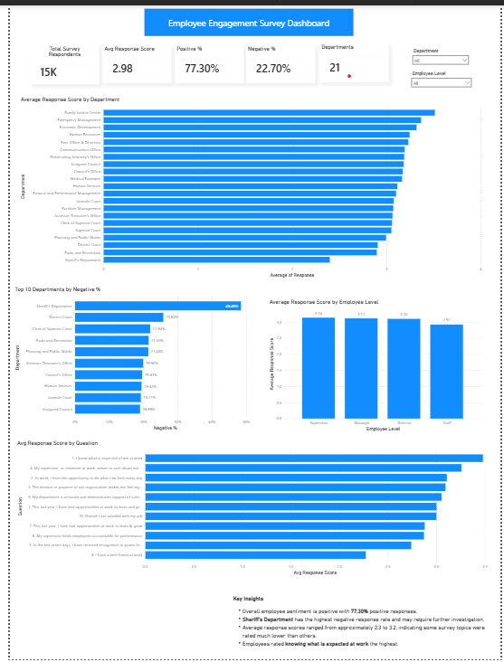

Employee Engagement Survey Dashboard
📌 Project Overview

This project analyzes employee engagement survey responses to evaluate overall employee satisfaction across departments and employee levels. The dashboard helps HR leaders and management identify strengths, areas of concern, and opportunities to improve employee engagement using interactive Power BI visualizations.

🎯 Business Problem

Employee engagement has a direct impact on productivity, retention, and organizational performance. HR management needs an easy way to understand:

Overall employee satisfaction
Departments requiring attention
Employee groups with lower satisfaction
Survey topics that need improvement

This dashboard provides data-driven insights to support better HR decision-making.

👥 Stakeholders
CEO
HR Manager
HR Team
❓ Business Questions Answered
What is the overall employee satisfaction level?
What percentage of employees gave positive and negative responses?
Which departments have the highest average satisfaction?
Which departments have the highest negative response rate?
How does employee satisfaction differ across employee levels?
Which survey questions received the highest and lowest ratings?
📊 KPI Cards
Total Survey Respondents
Average Response Score
Positive Response %
Negative Response %
Departments

📈 Dashboard Visuals
Average Response Score by Department

Compares the average survey score across departments to identify the highest and lowest performing departments.

Top Departments by Negative Response %

Highlights departments with the highest percentage of negative responses, helping management identify areas requiring attention.

Average Response Score by Employee Level

Compares satisfaction among Directors, Managers, Supervisors, and Staff.

Average Response Score by Survey Question

Shows how employees rated each survey question to identify organizational strengths and improvement opportunities.

🔍 Key Insights
Overall employee sentiment is positive, with 70.30% positive responses.
Some departments exhibit higher negative response rates and may require additional HR focus.
Employees clearly understand workplace expectations, which received one of the highest average ratings.
Certain engagement-related survey questions received comparatively lower scores, indicating potential areas for improvement.
Average satisfaction varies across employee levels, helping management identify specific employee groups for targeted initiatives.

🧹 Data Preparation

The dataset was cleaned and prepared before analysis by:

Checking for missing values
Reviewing duplicate records
Validating data types
Removing unnecessary columns
Formatting data where required
Creating DAX measures for KPIs and business metrics

📌 DAX Measures Used

Some of the key measures created include:

Total Survey Respondents
Average Response Score
Positive Response %
Negative Response %
Departments Surveyed

🛠 Tools & Technologies
Microsoft Power BI
Power Query
DAX

📂 Dataset

Employee Engagement Survey Dataset from Maven Analytics.

📷 Dashboard Preview

🚀 Project Outcome

The dashboard enables HR leaders and executives to monitor employee engagement, compare departmental performance, identify areas of concern, 
and prioritize initiatives that improve employee satisfaction and organizational culture.

💡 Skills Demonstrated
Data Cleaning
Data Modeling
DAX Measure Creation
KPI Development
Business Requirement Analysis
Interactive Dashboard Design
HR Analytics
Data Visualization
Insight Generation
Storytelling with Data

This section helps recruiters quickly understand what you practiced in the project
